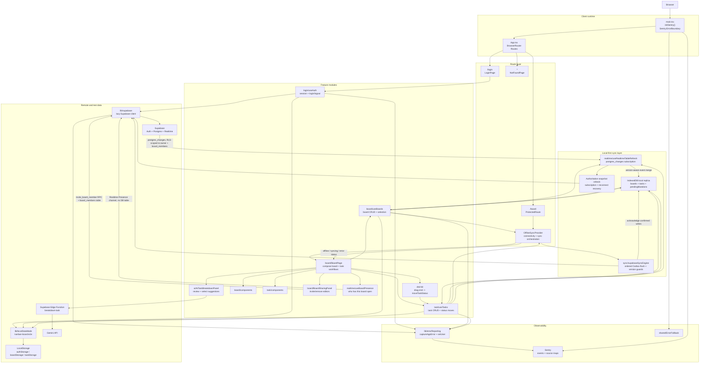
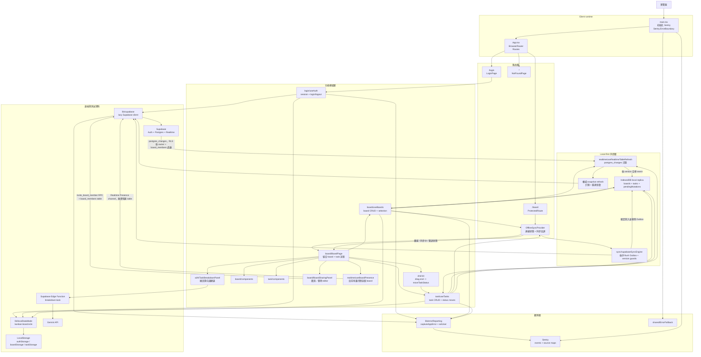

# Kanban Board

A Kanban-style task management app built with React, TypeScript, Vite, TailwindCSS, dnd-kit, React Router, Supabase, Gemini, Playwright, and Sentry.

The project focuses on a practical board workflow: authenticated users can create boards, use AI to break a requirement into tasks, manage tasks, and move tasks across statuses with drag-and-drop interactions. Its local-first synchronization layer keeps confirmed data and pending changes in IndexedDB, supports offline board and task operations, and reconciles changes through Supabase Realtime and background Outbox processing. It also includes a LocalStorage-backed data mode for stable end-to-end testing and frontend error monitoring for production debugging.

Live demo: https://kanban-board-two-tan.vercel.app

Demo account: `you@example.com` / `123`

## Features

- Email/password login with Supabase Auth
- Protected board route with React Router v7
- Board CRUD: create, edit, delete, and select boards
- Board sharing: owners invite collaborators by email as editors, who can view and manage tasks on the shared board but not its settings
- Presence avatars showing who else currently has the board open
- Task CRUD: create, edit, delete, and move tasks between statuses
- AI task breakdown with selectable task suggestions before bulk creation
- Drag-and-drop task status updates with dnd-kit
- Optimistic UI updates for faster perceived interactions
- Supabase persistence for boards, tasks, and user profiles
- Live board and task updates across active windows with Supabase Realtime
- IndexedDB local replica for cached server-confirmed data
- Offline board and task CRUD, including drag-and-drop status changes
- Durable pending-mutation Outbox with background retry, version conflict detection, and visible sync status
- LocalStorage-backed e2e mode for stable Playwright tests
- Responsive UI built with TailwindCSS
- Playwright coverage for login, board CRUD, task CRUD, and drag-and-drop flows
- Sentry frontend error monitoring with a global React Error Boundary, contextual exception reporting, user scoping, and source map uploads
- GitHub Actions CI/CD for linting, building, and Vercel deployment

## Tech Stack

- React
- TypeScript
- Vite
- TailwindCSS
- dnd-kit
- React Router v7
- Supabase
- Supabase Realtime
- IndexedDB through idb
- Gemini API through a Supabase Edge Function
- Sentry
- Playwright
- ESLint
- GitHub Actions
- Vercel

## Project Structure

```txt
src/
  404/          Not found route
  ai/           AI task breakdown UI and Edge Function client
  board/        Board page, board hooks, board components, board storage
  lib/          Supabase client, Sentry setup, error reporting, database types
  login/        Auth hooks, login page, local auth storage
  realtime/     Supabase Realtime subscriptions, connectivity, recovery hooks
  shared/       Shared UI components
  sync/         IndexedDB replica, pending Outbox, background sync engine
  task/         Task hooks, task components, task storage
  utils/        Optional browser metric helpers
e2e/            Playwright end-to-end tests
.github/        GitHub Actions CI/CD workflow
public/         Static assets
```

## Architecture Diagram



## Realtime and Offline Sync

The production data path uses Supabase as the authoritative store and IndexedDB as a viewer-scoped local replica (partitioned by the current user, which may be a board's owner or one of its invited editors). Realtime events speed up propagation between active windows, while snapshot refreshes repair the gap between an initial query and subscription readiness and recover authoritative state after reconnecting.

### Remote change flow

1. Supabase publishes an `INSERT`, `UPDATE`, or `DELETE` event for `boards` or `tasks` through `postgres_changes`.
2. The relevant feature hook ignores pending local entities, applies newer payloads with a version-aware merge, and persists the result to IndexedDB.
3. When a channel reaches `SUBSCRIBED`, the hook fetches an authoritative snapshot so events missed during subscription setup are repaired.
4. Snapshot replacement preserves pending local mutations before the hook renders the merged board or task state.

### Local change flow

1. A board or task action updates the UI immediately.
2. The entity change and its pending mutation are stored together in IndexedDB before background synchronization is requested.
3. `OfflineSyncProvider` reads the Outbox and asks `supabaseSyncEngine` to flush board upserts, task upserts, task deletes, and board deletes in dependency-safe order.
4. Updates and deletes use the mutation's `baseVersion` as an optimistic concurrency guard. Confirmed writes update the local replica and remove the acknowledged Outbox entry.
5. Transient failures retry with exponential backoff. Version conflicts remain as blocked mutations so the local change is not silently discarded.

The board screen reports offline, syncing, blocked, and failed states. Failed mutations can be retried manually, and logout stays disabled while pending changes remain. AI task breakdown remains network-dependent and is disabled while offline.

## Technical Trade-offs

| Choice                                             | Core Advantages (Pros)                                                                                                                                                                      | Potential Costs & Risks (Cons)                                                                                                                                                                                                                                 |
| :------------------------------------------------- | :------------------------------------------------------------------------------------------------------------------------------------------------------------------------------------------ | :------------------------------------------------------------------------------------------------------------------------------------------------------------------------------------------------------------------------------------------------------------- |
| **React + Vite**                                   | Extremely fast local startup and Hot Module Replacement (HMR). Lightweight frontend configuration with high development autonomy.                                                           | Lacks built-in support found in full-stack frameworks (like Next.js). Route management, global state, and deployment workflows (e.g., SPA static routing redirects) must be manually integrated and configured by developers.                                  |
| **Supabase (Auth & Database)**                     | Achieves a Serverless architecture, providing out-of-the-box Auth, PostgreSQL access, and auto-generated TypeScript types, drastically shortening the development lifecycle.                | Introduces Vendor Lock-in risks. Core data access patterns are tightly coupled with the platform, leading to a higher friction/pain period if migrating to a self-hosted backend or AWS in the future.                                                         |
| **Domain-Driven (Feature-Based) Folder Structure** | Enhances code cohesion. Grouping components, hooks, types, and helpers by domains (e.g., board, task, login) makes features highly discoverable and easier to modify.                       | Shared logic across different modules becomes harder to identify at a glance. The team must maintain high discipline to refactor timely and extract shared code into `shared/` or `lib/` to prevent duplicate implementations.                                 |
| **Centralizing Data Operations via Custom Hooks**  | Enforces separation of concerns. UI components focus purely on rendering, while complex asynchronous logic (Loading, Error, Optimistic Updates) is encapsulated within hooks.               | As business workflows grow highly complex, a single hook can easily become bloated and difficult to unit test due to handling both UI state and API data. In later stages, developers must consciously decouple pure logic, increasing refactoring time costs. |
| **Optimistic UI Updates**                          | Significantly improves user experience. Operations like CRUD and kanban drag-and-drop receive instant visual feedback, eliminating perceived network latency.                               | Increases the complexity of frontend state management. If a backend write fails, additional robust rollback mechanisms and seamless error notifications must be carefully designed.                                                                            |
| **LocalStorage E2E Mode (Playwright)**             | Decentralizes the testing environment. E2E tests run independently of real Supabase sessions or remote database states, drastically improving test stability and execution speed.           | The behavior of the mock persistence used in the test environment may not perfectly match the real production Supabase behavior, potentially missing certain edge cases.                                                                                       |
| **Sentry Monitoring**                              | Establishes error tracking (Observability) in the production environment. Leverages Source Maps to un-minify compressed code, enabling precise production error localization and debugging. | Requires additional DSN configuration and handling source map uploads within the CI/CD pipeline, increasing the complexity of environmental variables management and build workflows.                                                                          |
| **IndexedDB Local Replica + Durable Outbox**       | Keeps confirmed data available locally and lets board/task changes survive offline sessions or temporary network failures until background synchronization succeeds.                       | Requires explicit cache ownership, ordered mutation processing, retry policy, and conflict state management. IndexedDB schema changes also need careful compatibility handling.                                                                                |
| **Realtime Notifications + Snapshot Recovery**    | Realtime events quickly propagate changes between active windows, while authoritative snapshots repair missed events during subscription setup or reconnects.                              | Requires Supabase Realtime publication configuration and additional snapshot requests. Event payloads still need version-aware filtering because delivery timing and duplication are not authoritative ordering guarantees.                                    |

## Observability

The current Sentry setup is focused on production error visibility:

- `Sentry.ErrorBoundary` wraps the React app and shows a fallback UI when an uncaught render-time error reaches the app boundary.
- `captureAppError` adds `area` and `action` tags plus contextual metadata before sending exceptions to Sentry.
- Auth, Supabase initialization, board operations, task operations, LocalStorage operations, and drag-and-drop task moves report unexpected exceptions.
- `Sentry.setUser` scopes events by user id only; local test users are anonymized as `local-user`.
- `sendDefaultPii` is disabled to avoid default PII collection.
- The Vite build generates source maps, and `@sentry/vite-plugin` uploads them for readable production stack traces.

## Getting Started

### Prerequisites

- Node.js
- npm
- A Supabase project
- A deployed Supabase Edge Function named `breakdown-task` with its Gemini API key configured as a server-side secret

### Install dependencies

```bash
npm install
```

### Environment variables

Create a `.env` file in the project root:

```bash
VITE_SUPABASE_URL=your_supabase_project_url
VITE_SUPABASE_ANON_KEY=your_supabase_anon_key
VITE_SENTRY_DSN=your_sentry_frontend_dsn
```

`VITE_SENTRY_DSN` is optional for local development. Without it, Sentry will not send events.

The browser invokes the `breakdown-task` Supabase Edge Function. Keep the Gemini API key in the Edge Function environment and do not expose it through a `VITE_` environment variable.

For production source map uploads, the build environment also needs:

```bash
SENTRY_AUTH_TOKEN=your_sentry_auth_token
SENTRY_ORG=your_sentry_org_slug
SENTRY_PROJECT=your_sentry_project_slug
```

The app expects these Supabase tables:

- `profiles`
- `boards`
- `tasks`
- `board_members`

Both `boards` and `tasks` require a numeric `version` column for optimistic concurrency checks. Enable both tables in the Supabase Realtime publication so the client can receive `postgres_changes` events.

`board_members` maps `board_id`/`user_id` pairs to a role (currently only `editor`) and is populated through the `invite_board_member` RPC rather than direct inserts. RLS grants `boards` (select only) and `tasks` (select/insert/update/delete) access to both the board owner and any of its members, while board settings (rename, delete, invite, remove members) stay owner-only.

The generated type definitions are stored in `src/lib/database.types.ts`.

### Use AI task breakdown

1. Select a board and enter a requirement in the **AI task breakdown** panel.
2. Generate suggestions, review them, and deselect any tasks you do not want.
3. Create the selected suggestions in the current board. Generated tasks default to the `todo` status unless the AI response specifies another valid board status.

### Run locally

```bash
npm run dev
```

### Build

```bash
npm run build
```

### Preview production build

```bash
npm run preview
```

### Lint

```bash
npm run lint
```

### End-to-end tests

```bash
npx playwright install
npm run test:e2e
```

The Playwright tests enable local data mode by setting `kanban-board:e2e` in `localStorage`, so the test flow does not depend on a live Supabase session.

## CI/CD

The GitHub Actions workflow runs on pushes and pull requests targeting `main`.

- `checks`: installs dependencies, runs ESLint, runs unit/integration tests, and builds the app.
- `deploy`: runs on pushes to `main`, builds the Vercel production output, and deploys with the Vercel CLI.

---

# Kanban Board 中文說明

這是一個使用 React、TypeScript、Vite、TailwindCSS、dnd-kit、React Router、Supabase、Gemini、Playwright 和 Sentry 建立的 Kanban 任務管理專案。

專案重點是實作實用的看板工作流程：使用者登入後可以建立 board、透過 AI 將需求拆成 tasks、管理 task，並透過拖拉操作更新 task 狀態。Local-first 同步層會將已確認資料與待同步變更保存在 IndexedDB，支援離線操作 board 與 task，再透過 Supabase Realtime 和背景 Outbox 處理同步。專案也提供 LocalStorage-backed data mode，讓 Playwright e2e 測試可以穩定執行，並加入前端錯誤監控，方便 production debugging。

Demo：https://kanban-board-two-tan.vercel.app

測試帳號: `you@example.com` / `123`

## 功能

- 使用 Supabase Auth 實作 email/password 登入
- 使用 React Router v7 實作受保護的 board 頁面
- Board CRUD：建立、編輯、刪除、切換 board
- Board 共享：owner 可以用 email 邀請協作者成為 editor，editor 能查看並管理共享 board 上的 tasks，但不能更動 board 設定
- Presence 頭像，顯示目前還有誰打開這個 board
- Task CRUD：建立、編輯、刪除、移動 task 狀態
- 使用 AI 拆解需求，確認並勾選建議項目後批次建立 tasks
- 使用 dnd-kit 實作拖拉更新 task 狀態
- 使用 optimistic UI update 提升操作回饋速度
- 使用 Supabase 儲存 profiles、boards 與 tasks
- 使用 Supabase Realtime 在已開啟的視窗間即時更新 board 與 task
- 使用 IndexedDB local replica 快取伺服器已確認的資料
- 支援離線執行 board／task CRUD 與拖拉更新狀態
- 使用 durable pending-mutation Outbox、背景重試、版本衝突偵測與可見的同步狀態
- 提供 LocalStorage-backed e2e mode，讓測試流程更穩定
- 使用 TailwindCSS 建立響應式介面
- 使用 Playwright 測試登入、board CRUD、task CRUD、拖拉流程
- 使用 Sentry 做前端錯誤監控，包含全域 React Error Boundary、帶 context 的 exception reporting、user scoping 和 source map upload
- 使用 GitHub Actions 執行 lint、build 和 Vercel deployment

## 技術棧

- React
- TypeScript
- Vite
- TailwindCSS
- dnd-kit
- React Router v7
- Supabase
- Supabase Realtime
- 透過 idb 使用 IndexedDB
- 透過 Supabase Edge Function 串接 Gemini API
- Sentry
- Playwright
- ESLint
- GitHub Actions
- Vercel

## 專案結構

```txt
src/
  404/          404 頁面
  ai/           AI 拆任務 UI 與 Edge Function client
  board/        Board 頁面、hooks、components、storage
  lib/          Supabase client、Sentry 設定、error reporting、資料庫型別
  login/        Auth hooks、登入頁、local auth storage
  realtime/     Supabase Realtime 訂閱、連線狀態與恢復 hooks
  shared/       共用 UI components
  sync/         IndexedDB replica、pending Outbox、背景同步引擎
  task/         Task hooks、components、storage
  utils/        可選的瀏覽器效能指標 helper
e2e/            Playwright end-to-end tests
.github/        GitHub Actions CI/CD workflow
public/         靜態資源
```

## 架構圖



## 即時與離線同步

Production 資料流以 Supabase 作為權威資料來源，IndexedDB 則作為以目前使用者（可能是 board 的 owner，也可能是被邀請的 editor）為分區的 local replica。Realtime events 會加快已開啟視窗間的資料傳遞，而 snapshot refresh 會修補初始查詢到訂閱完成之間的空窗，並在重新連線後恢復權威資料狀態。

### 遠端變更流程

1. Supabase 透過 `postgres_changes` 發布 `boards` 或 `tasks` 的 `INSERT`、`UPDATE`、`DELETE` event。
2. 對應的功能 hook 會略過仍有本機 pending mutation 的 entity，以 version-aware merge 套用較新的 payload，並將結果寫入 IndexedDB。
3. Channel 進入 `SUBSCRIBED` 後，hook 會重新取得 authoritative snapshot，修補建立訂閱期間可能漏掉的 events。
4. Snapshot replacement 會保留尚未同步的本機 mutations，再由 hook 渲染合併後的 board 或 task 狀態。

### 本機變更流程

1. Board 或 task 操作會立即更新 UI。
2. Entity 變更及其 pending mutation 會一起寫入 IndexedDB，完成後再請求背景同步。
3. `OfflineSyncProvider` 讀取 Outbox，並由 `supabaseSyncEngine` 依照相依安全的順序處理 board upsert、task upsert、task delete 與 board delete。
4. Update 與 delete 使用 mutation 的 `baseVersion` 作為 optimistic concurrency guard。遠端確認成功後會更新 local replica，並移除已 acknowledge 的 Outbox entry。
5. Transient failure 會以 exponential backoff 自動重試；版本衝突則保留為 blocked mutation，避免無聲捨棄本機變更。

Board 畫面會顯示離線、同步中、blocked 與失敗狀態。同步失敗時可以手動重試；只要還有 pending changes，登出功能就會維持停用。AI 拆任務仍依賴網路，離線時會停用。

## 技術取捨

| 選擇                                     | 核心優勢（原因）                                                                                                   | 潛在代價與風險                                                                                                                                                      |
| :--------------------------------------- | :----------------------------------------------------------------------------------------------------------------- | :------------------------------------------------------------------------------------------------------------------------------------------------------------------ |
| **React + Vite**                         | 本機啟動與熱更新（HMR）極快，前端配置輕量、開發自主性高。                                                          | 缺乏全端框架（如 Next.js）的內建支持，路由、狀態管理與部署流程（如 SPA 靜態重導向）需要開發者自行手動整合與配置。                                                   |
| **Supabase (Auth & Database)**           | 實現 Serverless 架構，開箱即用 Auth、PostgreSQL 存取與自動生成的 TypeScript Types，大幅縮短開發週期。              | 會產生供應商鎖定（Vendor Lock-in）風險，核心資料存取與平台高度綁定，未來若要遷移至自建後端或 AWS 的陣痛期較高。                                                     |
| **功能模組化資料夾結構 (Domain-Driven)** | 提高程式碼的凝聚性。將 board、task、login 的組件、hooks、types 集中在各自資料夾內，改動功能時非常好找。            | 跨模組的共用邏輯會變得比較難一眼識別，團隊需要保持高度紀律及時重構，將共用代碼抽離至 `shared/` 或 `lib/`，以防重複實作。                                            |
| **客製化 Hooks 集中管理資料操作**        | 讓 UI 組件只專注於渲染畫面，將 Loading、Error、Optimistic Updates 等複雜的非同步處理邏輯封裝在 Hooks 中。          | 當業務流程高度複雜時，單一 Hook 容易因為同時處理「畫面狀態」與「後端 API 資料」而變得龐大且難以測試；專案中後期需要有意識地將純邏輯抽離出來，會增加重構的時間成本。 |
| **樂觀更新 (Optimistic UI Updates)**     | 顯著提升使用者體驗。CRUD 與看板拖拉移動等操作能獲得即時的畫面回饋，消除網路延遲的卡頓感。                          | 增加了前端狀態管理的複雜度，當後端寫入失敗時，需要額外設計嚴密的狀態回滾（Rollback）機制與流暢的錯誤提示。                                                          |
| **LocalStorage E2E Mode (Playwright)**   | 讓測試環境去中心化。E2E 測試不需依賴真實的 Supabase Session 或遠端資料庫狀態，大幅提升測試的穩定度與執行速度。     | 測試環境使用的 Mock 資料夾行為與 Production 環境的 Supabase 真實行為無法完全一致，可能漏掉部分極端邊界情況（Edge Cases）。                                          |
| **Sentry 監控機制**                      | 建立 Production 環境的錯誤追蹤（Observability），結合 Source Maps 將壓縮代碼還原，實現精準的線上錯誤定位與 Debug。 | 需額外設定 DSN、處理 CI/CD 流程中的 Source Map 自動上傳與環境變數管理，會增加建置流程的複雜度。                                                                     |
| **IndexedDB Local Replica + Durable Outbox** | 讓已確認資料可在本機使用，board／task 變更也能跨越離線期間或暫時網路失敗，直到背景同步成功。 | 需要明確管理 cache ownership、mutation 執行順序、重試策略與衝突狀態；IndexedDB schema 變更也必須審慎處理相容性。 |
| **Realtime 通知 + Snapshot Recovery**    | Realtime events 能快速把變更傳遞到已開啟的視窗，authoritative snapshots 則修補訂閱建立或重連期間漏掉的 events。 | 需要設定 Supabase Realtime publication，也會增加 snapshot requests；event 傳遞時間與重複事件不能視為權威順序，仍須以 version-aware 規則過濾。 |

## 可觀測性

目前的 Sentry 設定重點是 production error visibility：

- 使用 `Sentry.ErrorBoundary` 包住 React app，當 render 階段的未處理錯誤抵達 app boundary 時，會顯示 fallback UI。
- 使用 `captureAppError` 在送出例外前加上 `area`、`action` tags 與額外 context。
- Auth、Supabase 初始化、board 操作、task 操作、LocalStorage 操作與拖拉移動 task 的非預期例外會上傳到 Sentry。
- 使用 `Sentry.setUser` 只設定 user id；local test user 會匿名成 `local-user`。
- 關閉 `sendDefaultPii`，避免 Sentry 收集預設 PII。
- Vite build 會產生 source maps，並透過 `@sentry/vite-plugin` 上傳，讓 production stack trace 可以還原到原始碼。

## 開始使用

### 前置需求

- Node.js
- npm
- Supabase project
- 已部署名為 `breakdown-task` 的 Supabase Edge Function，並在 server-side secret 設定 Gemini API key

### 安裝依賴

```bash
npm install
```

### 環境變數

在專案根目錄建立 `.env`：

```bash
VITE_SUPABASE_URL=your_supabase_project_url
VITE_SUPABASE_ANON_KEY=your_supabase_anon_key
VITE_SENTRY_DSN=your_sentry_frontend_dsn
```

`VITE_SENTRY_DSN` 對本機開發是選填；沒有設定時，Sentry 不會送出事件。

瀏覽器會呼叫 Supabase 的 `breakdown-task` Edge Function。Gemini API key 必須存放在 Edge Function 環境中，不可透過 `VITE_` 環境變數暴露給瀏覽器。

若 production build 需要上傳 source maps，build 環境也需要：

```bash
SENTRY_AUTH_TOKEN=your_sentry_auth_token
SENTRY_ORG=your_sentry_org_slug
SENTRY_PROJECT=your_sentry_project_slug
```

目前專案預期 Supabase 內有以下 tables：

- `profiles`
- `boards`
- `tasks`
- `board_members`

`boards` 與 `tasks` 都必須具有數字型別的 `version` 欄位，供 optimistic concurrency check 使用；也必須將這兩個 tables 加入 Supabase Realtime publication，client 才能收到 `postgres_changes` events。

`board_members` 記錄 `board_id`/`user_id` 與角色（目前只有 `editor`）的對應，只能透過 `invite_board_member` 這個 RPC 新增，不能直接 insert。RLS 讓 board owner 和任何成員都能存取 `boards`（僅 select）與 `tasks`（select/insert/update/delete），但 board 設定（改名、刪除、邀請／移除成員）仍然只有 owner 能做。

產生出的資料庫型別放在 `src/lib/database.types.ts`。

### 使用 AI 拆任務

1. 選擇 board，在「AI 拆任務」區塊輸入要拆解的需求。
2. 產生建議後檢查內容，取消勾選不需要的 tasks。
3. 將選取的建議批次加入目前的 board。若 AI 未回傳有效的 board 狀態，task 會預設建立在 `todo`。

### 本機開發

```bash
npm run dev
```

### 建置

```bash
npm run build
```

### 預覽 production build

```bash
npm run preview
```

### Lint

```bash
npm run lint
```

### End-to-end 測試

```bash
npx playwright install
npm run test:e2e
```

Playwright 測試會在 `localStorage` 設定 `kanban-board:e2e`，讓測試改用本機資料模式，因此不需要依賴實際 Supabase 登入 session。

## CI/CD

GitHub Actions workflow 會在 push 和 pull request 目標為 `main` 時執行。

- `checks`：安裝依賴、執行 ESLint、執行單元與整合測試、建置 app。
- `deploy`：只在 push 到 `main` 時執行，使用 Vercel CLI 建置 production output 並部署。
